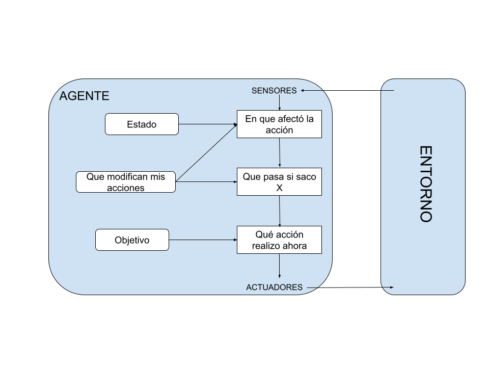

# Rock-paper-scissors-lizard-spock
Práctica del curso de especialización de Inteligencia Artificial y Big Data - IES de Teis
Realizado por: Samuel Andón Novo

# Entorno de tareas
Entorno de tareas | Observable| Agentes | Determinista | Episódico | Estático | Discreto | Conocido
:---: | :---: | :---: | :---: | :---: | :---: | :---: | :---: |
 RPS | Parcialmente observable | Multiagente | Determinista | Episódico | Estático | Discreto | Conocido |

- **Parcialmente observable:** debido a que a la hora de llevar a cabo la acción, no contamos con la visión total del entorno del juego. Es decir, no contamos con información acerca del adversario hasta que no realiza su acción de sacar una de las 3 posibilidades.
- **Multiagente:** para llegar al objetivo del juego, el cuál es ganar, es necesario jugar contra alguien.
- **Determinista:** conocemos las opciones que pueden realizar los jugadores (piedra, papel y tijera), sin existir ningún elemento aleatorio que permita la creación de una nueva opción.
- **Episódico:** centrándonos en que el entorno es cada una de las partidas, única y exclusivamente cada partida, las acciones realizadas hasta cumplir el objetivo del juego no dependen en nada para la siguiente partida.
- **Estático:** mientras que los jugadores deliberan las acciones que van realizar, no cambia el entorno.
- **Discreto:** hay número finito de posibilidades a realizar.
- **Conocido:** ya que es conocido y jugado por millones de personas.

## Estructura del agente
Mi modelo del agente está inspirado en el modelo agente basado en objetivos, ya que la finalidad del piedra, papel y tijera es intentar ganar las máximas partidas, con lo cual hay un objetivo concreto.

## Implementación - Simulando IA

Lo primero fue añadir que el usuario introduzca el número de partidas que va querer jugar, tras eso empecé con el algoritmo de mi estrategia.

Mi estrategía consiste en varios factores, en la primera partida sacaré siempre papel ya que por probabilidad general la gente suele empezar sacando piedra. Después por cada partida guardaré las veces que saca cada elemento del juego en un diccinario, donde cojo la opción que más usa y saca la opción que le gana. En caso de que haya empate en veces que se uso cada elemento, hice una lista con la orden de prioridad, es decir en caso de que sacara 2 veces piedra y papel, cojeriamos piedra por prioridad y sacariamos el contrario, papel. En este caso al haber dos posibles opciones de victoria hacia un movimiento, implemente un código mediante el cual dependiendo de si el número de la partida en la que se encuentre es par utilice un movimiento y si es impar otro.

Además, implementé un contador de victorias que se va incrementando por cada victoria del usuario, indicandole al final el numero de partidas jugadas y cuantas dellas ganó.

## Bibliografía

- Inteligencia Artificial un enfoque moderno, 2da Ed (Stuart Russell y Peter Norvig)